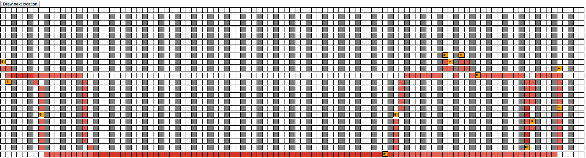
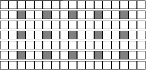
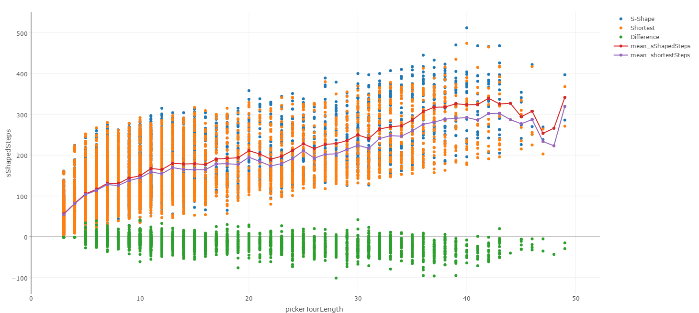
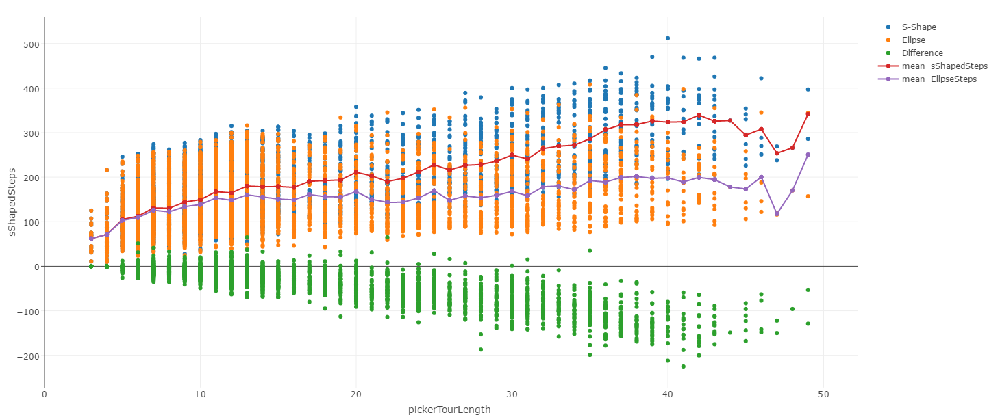

# warehouse-path

Show the picker path in a warehouse based on the warehouse configuration



### Table of content
[Algo folder](#algos-folder)<br>
[script.js](#scriptjs)<br>
[pickerTour.js](#pickertourjs)<br>
[warehouseDisplay.js](#warehousedisplayjs)<br>
[Reading list and useful websites](#reading-list-and-useful-websites)

## Algos folder

In this folder you can find all the related algorithms used by this repo

### ellipse.js

Description WIP

### closestNeighbour.js

This file contains 1 function **shortestPathBetweenLocations**. This function will reorder the picker tour by finding the closest location at each round when the picker will go to another location.

_For the record, this is a really dumb algo, but still work better thant the S-Shaped form._

### sShapedLocations.js

This file contains 2 function **sShapedLocationAsc** and **sShapedLocationDesc**. This function will reorder the picker tour by ascending or descending way. Like this the picker will go to the next location in name order.

## script.js

This your file where you create your warehouse, your picker tour and all the stuff you want to try...

## pickerTour.js

This file contains all the functions used to draw or calculate the tour of a picker in a warehouse.

### locationsListToMatrixData

`locationsListToMatrixData :: [String] -> Function -> Function`

This function will transform your list of locations to `x` and `y` coordinates for the matrix. It will do so via the `Function` passed as argument.

### locationToMatrixData

`locationToMatrixData :: String -> Function -> Function`

This function is the sister of `locationsListToMatrixData` in a sense that this one will transform in coordinates 1 location. In the implementation of `locationsListToMatrixData` we use `locationToMatrixData` to do the work on a single location.

### uniqLocations

`uniqLocations :: [String] -> [String]`

This function will take a locations list and return a new list with all the distinct locations from the original one. It uses `_.uniq` to do the work.

### uniqMatrixLocations

`uniqMatrixLocations :: [Array] -> [Array]`

This function is the cousin of `uniqLocations` in a sense that is will do the same job but will work with matrix coordinates. It uses `_.uniqBy` and `_.isEqual` to do the work.

### highlightPathBetweenManyLocations

`highlightPathBetweenManyLocations :: NodeList -> [Array] -> [Array]`

This function will map against the many locations to draw the picker path in the `DOM`. It use the function `highlightPathBetweenTwoLocations` to do the work.

### highlightPathBetweenTwoLocations

`highlightPathBetweenTwoLocations :: NodeList -> [Array] -> [Array]`

This function will that the path between 2 locations and `DOM elements = NodeList` to change the `class` linked to the nodes that the picker will take.

### startAndEndAtSameALocation

`startAndEndAtSameALocation :: String -> [String] -> [String]`

This function uses `startFromALocation` and `endAtALocation` to improve the picker tour list to start and end at the same point. This is useful want the picker finish a previous tour and want to begin a new one.

### startFromALocation

`startFromALocation :: String -> [String] -> [String]`

Use this function when your picker tour doesn't include at first the starting point (eg: the sorting area or packing area). This might be a point that is on the border of the warehouse. The function will return the picker tour list plus the starting location at the beginning of the list.

### endAtALocation

`endAtALocation :: String -> [String] -> [String]`

Use this function when your picker tour doesn't include at first the ending point (eg: the sorting area or packing area). This might be a point that is on the border of the warehouse. The function will return the picker tour list plus the ending location at the end of the list.

### createPathBetweenManyLocations

`createPathBetweenManyLocations :: warehouseMatrix -> [Array] -> [Array]`

This function will give you the path between multiple locations for the picker tour. It uses `createPathBetweenTwoLocations` to do the work.

### createPathBetweenTwoLocations

`createPathBetweenTwoLocations :: warehouseMatrix -> [Number, Number] -> [Number, Number] -> [Array]`

This function will give you the path between 2 locations for the picker tour. We use the `A*` algorithm to find the path. We use [PathFinding.js](https://github.com/qiao/PathFinding.js) library to do it.

### createMatrixWithShortestPathBetweenLocations

`createMatrixWithShortestPathBetweenLocations :: warehouseMatrix -> [String] -> Function -> Object`

This function will return an object with the shortest distances between all location in a picker tour. This will be useful for an algo to choose to which locations to go after the current one.

### testAlgoOnManyBatchesReduce

`testAlgoOnManyBatchesReduce :: [Array] -> [Array] -> String -> Number`

This function will return the difference of steps between the two available algos `S-Shaped` and `closest neighbour`. The steps don't represent actual meters because each warehouse configuration is different you will need to convert it to another unit if you want to use it to take some decisions.

### testAlgoOnManyBatchesDisplay

`testAlgoOnManyBatchesDisplay :: [Array] -> [Array] -> String -> Number -> Boolean -> Nodelist`

This function will display on the `DOM` the different path used for the two available algos `S-Shaped` and `closest neighbour`. If you use many picker tour, the function will run a long time...

### testAlgoOnManyBatchesResultForCSV

`testAlgoOnManyBatchesResultForCSV :: [Array] -> [Array] -> String -> [Object]`

This function will display to the `DOM` a list of `Object` that you can turn to a `CSV` file via other tools like this [one](https://konklone.io/json/).

## warehouseDisplay.js

This file contains all the functions used to draw or create a warehouse with the configuration you wish.

### drawWarehouse

`drawWarehouse :: warehouseMatrix -> DOM element -> String -> Nodelist`

This function will create in the `DOM element` provided the warehouse based on the `warehouseMatrix`. You can find the warehouse by the `String` passed that will be added has `class` for all the rows.

#### Examples

```js
// 0 is walkable ; 1 is a wall
const warehouseMatrix = [
		[0, 0, 0, 0, 0],
		[0, 0, 1, 0, 0],
		[0, 0, 1, 0, 0],
		[0, 0, 0, 0, 0]
	];

drawWarehouse(warehouseMatrix, "body", "row");
```



### createWarehouseMatrix

`createWarehouseMatrix :: Number -> Number -> [Number] -> [Array]`

This function will create a matrix based on the configuration provided.

#### Examples

```js
// 0 is walkable ; 1 is a wall
const warehouseHeight = 12; // Number of racks in an aisle
const warehouseWidth = 6; // Number of aisles in a warehouse
const warehouseSeparation = [2, 4] // 0 index based

createWarehouseMatrix(warehouseHeight, warehouseWidth, warehouseSeparation);

// This will return a matrix like this :

[
	[0, 0, 0, 0, 0, ...],
	[0, 0, 1, 0, 0, ...],
	[0, 0, 1, 0, 0, ...],
	[0, 0, 1, 0, 0, ...],
	...
	...
	[0, 0, 0, 0, 0, ...]
]
```

This will render into the `DOM` with the help of `drawWarehouse`. _The first and last row will always be walkable_.

## Performance between `S-Shaped` and `closest neighbour` algos



* S-Shape = `S-Shaped`
* Shortest = `closest neighbour`
* Difference = `closest neighbour` steps for a given picker tour **minus** `S-Shaped` steps for a given picker tour

The `closest neighbour` tends to performance better than the `S-Shaped` and this is even more true as the number of locations in a picker tour increase.

## Performance between `S-Shaped` and `ellipse` algos



* S-Shape = `S-Shaped`
* Ellipse = `ellipse`
* Difference = `ellipse` steps for a given picker tour **minus** `S-Shaped` steps for a given picker tour

The `ellipse` tends to performance better than the `S-Shaped` and this is even more true as the number of locations in a picker tour increase. It also outperform the `closest neighbour` algo.

## Reading list and useful websites

* https://simple.wikipedia.org/wiki/Travelling_salesman_problem
* https://simple.wikipedia.org/wiki/Monte_Carlo_algorithm
* https://simple.wikipedia.org/wiki/Las_Vegas_algorithm
* https://en.wikipedia.org/wiki/Branch_and_bound
* https://m3ideas.org/2014/09/26/walking-directions-in-a-warehouse-part-2/
* http://will.thimbleby.net/a-shortest-path-in-javascript/
* http://theory.stanford.edu/~amitp/GameProgramming/
* https://en.wikipedia.org/wiki/Artificial_ants
* http://www.cse.yorku.ca/~aaw/Zambito/TSP_Euclidean_PTAS.pdf
* https://en.wikipedia.org/wiki/Euclidean_distance
* http://gbb.mehr-davon.de/
* http://gbb.mehr-davon.de/content/median-circle-problem/example.html
* http://mathworld.wolfram.com/Ellipse.html
* https://developers.google.com/optimization/routing/tsp/tsp
